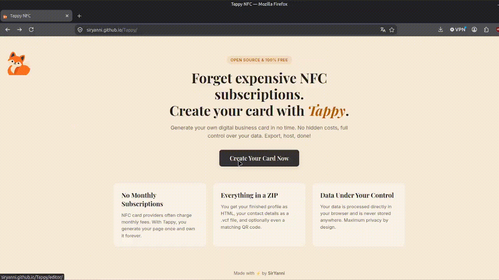

# Tappy © SirYanni 2026 GPLv3 

### A free, NFC business card generator that runs locally on your computer via your browser interface. Create a digital business card, customize its design, and export it (web profile, vCard and QR code)!  

  

## Features  
1. **Custom Profiles** Create your personal Profile with info including: Name, contact info, bio, and socials in an HTML!
2. **vCard Generation:** Generate a custom contact file that can be saved on any Phone! 
3. **Mutiple Themes:** Choose between a variaty of themes!
4. **QR-Code:** Generate a QR Code that will, like your NFC lead to your custom Webside!
5. **Local Processing:** No Data ever leaves your device during Generation, fully Private.

## How It Works

1.**Create your profile:** Open the Tappy editor, enter your information, upload a profile picture and choose one out of 4 themes.

2.**Export:** Tappy generates a ZIP package containing your profile page, vCard and optionally, QR code.

3.**Host your profile:** Upload the generated files to any static hosting provider, such as GitHub Pages, Netlify, Vercel or your own Server.

4.**Connect your NFC-Card:** Write the URL of your hosted profile to an NFC tag or card using any NFC writing app.

Once configured, tapping the NFC card with a smartphone or scanning the QR-Code opens your digital business card.

## AI Usage

AI tools were used as a development aid during the development of Tappy, mainly for debugging, discussing implementation approaches, and getting suggestions when I was stuck on technical problems (e.g. Base64 implementation)
I reviewed, adapted and tested the generated suggestions myself. The project concept, design decisions and feature selection were my own.
So **please**, dear Contributer use AI in a responsible Way.

## License
This Project is license under GPLv3.
